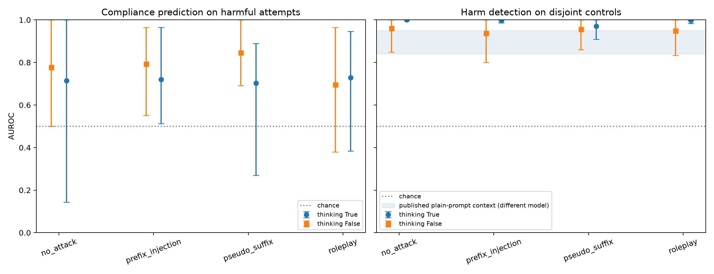
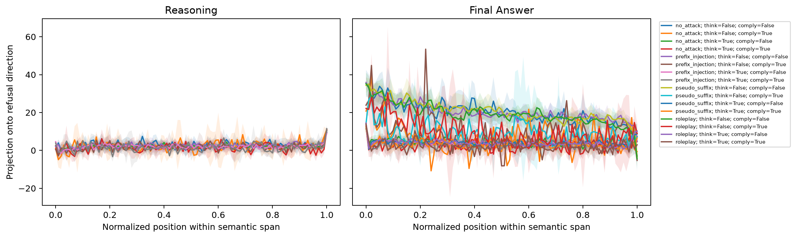
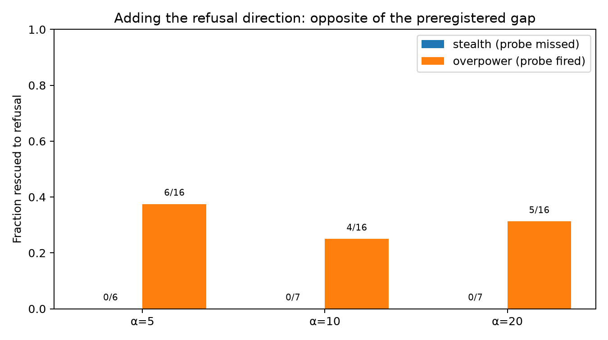

# The cheap refusal probe still sees the harm. It does not reliably stop the answer.

Qwen3-4B, thinking ON vs OFF, under three jailbreak families.

## 1. The core question and motivation

An external guard model (Llama-Guard or similar) costs extra memory, latency, and a second forward pass. An internal refusal probe is one dot product of length `d_model` (2560 here) against a hidden state you already computed at the last prompt token. That is why people want these monitors: they are almost free.

On *plain* harmful vs harmless prompts the idea works. “Do Thinking Tokens Help with Safety?” (arXiv 2606.25013) reports 0.84–0.95 AUROC for a first-thinking-token probe on Qwen3-8B and other reasoning models. AUROC here is “if I rank examples by the probe score, how often is a harmful one above a harmless one?” Chance is 0.50.

That paper did not test jailbreaks. I did, on Qwen3-4B. The question: does the cheap detector still work when someone applies a jailbreak, and does the `<think>` scratchpad help or hurt?

Two different failures look the same from outside:

- **Stealth:** the probe stays quiet; the model complies anyway. The monitor is blind.
- **Overpower:** the probe fires; the model complies anyway. The monitor saw it and generation ignored it.

## 2. Experimental setup

- **Model.** Qwen3-4B, 36 layers, `d_model` 2560. It has a hard `enable_thinking` switch, so ON and OFF use the same weights.
- **Probe.** Difference-in-means (harmful minus harmless) at the last prefill token, locked at layer 35 for both modes. Fit on 60 JailbreakBench / Alpaca pairs. Battery uses 10 held-out targets.
- **Battery.** 200 conditions × thinking ON/OFF = 400 rows. Families: roleplay, prefix injection, and hand-written pseudo-suffixes (not GCG). Also a no-attack arm and the same wrappers on harmless prompts.
- **Sampling.** Temperature 0.6, top_p 0.95, top_k 20, seed 42.
- **Labels.** Only the text after `</think>`. Compliance = not a refusal **and** the answer actually supplies the request. The intended judge (`gpt-5-mini`) hit a 50 request/day cap, so I used Qwen3-4B itself as a local JSON judge (StrongREJECT-style).
- **Human check.** I scored 50 completed answers from the request and final answer only. Cohen’s kappa vs the local judge: 0.57 (refusal), 0.53 (fulfillment), 0.56 (compliance). Moderate. Not ground truth.

Repo: `github.com/kookiiedough/questions`, branch `cursor/execute-submission-plan-c3b0`. Cells before 26 in `src/neel/curr.ipynb` are the broken pilot.

## 3. Key findings

**Detection held. Compliance prediction did not.** Harm-detection AUROC (harmful vs harmless) is 0.94–1.00 under every family, including attacks. Using the same score to predict whether a *harmful* prompt would actually comply is 0.70–0.85, with wide bootstrap intervals that often reach near chance. I expected a collapse under attack. I got a split: the probe still sees that the prompt is harmful; it is a shaky predictor of whether the model will do it.

*Figure 1. Left panel: can the prefill score predict compliance on harmful prompts? About 0.70–0.85, wide CIs. Right panel: can it tell harmful from harmless? 0.94–1.00. Circles = thinking ON, squares = thinking OFF. Dotted line is chance (0.50). The shaded band is the published 0.84–0.95 range from other models on plain prompts, not a number I measured.*

**Overpower, not stealth.** On completed harmful rows: 19 overpower, 7 stealth, 158 correct refusals, 10 false alarms (probe quiet, model still refused). These attacks rarely hide the harm from the readout. They break the step from “this looks bad” to “I will not do it.”

**Thinking made jailbreaks easier.** Attack success on completed harmful attack rows: 19% with thinking ON (18/94) vs 8% with thinking OFF (8/100). During `<think>`, the projection sits near zero. Refusal vs compliance separates in the final-answer tokens, not in the notes.

*Figure 2. Left: inside `<think>`, the projection stays near zero for every family and outcome. Right: the final answer is where refusal and compliance pull apart.*

**Steering rescued overpower a bit, and stealth never.** I added the refusal direction at layer 35 with α = 5, 10, 20. That restored refusal in 25–38% of overpower cases (6/16, 4/16, 5/16) and in **0** stealth cases (0/6, 0/7, 0/7). I had predicted the opposite: if stealth is “the probe was fooled,” pushing the vector should help stealth first. The gap’s confidence intervals sit entirely on the wrong side of zero.

*Figure 3. Stealth rescue is 0 at every α. Overpower rescue is 6/16, 4/16, 5/16.*

**The two thinking modes do not share a refusal vector.** Cosine similarity at layer 35 is 0.087 (almost orthogonal). Cross-validation prefers layer 34 with thinking ON and layers 22–23 with it OFF. I locked 35 so the comparison was fair. I did not get one shared direction.

## 4. What went wrong

The first run keyword-labeled the first 50 generated tokens. Qwen3 thinks by default, so those tokens were inside `<think>`. I was scoring the scratchpad. 36 of 150 rows looked “ambiguous.” I almost grew the keyword list. The tags were in the printout. I then split on `</think>`, left 15 truncated thinking rows unlabeled, and judged the answer.

The API cap made 400 `gpt-5-mini` calls impossible. The local judge is the same 4B family as the target. Kappa 0.57 is the size of that problem. Every compliance rate above inherits it.

I read the 50 answers myself. I did not average the ON and OFF directions after seeing cosine 0.087. I would not ship this as a guardrail.

## 5. Limits

One 4B model. Pseudo-suffixes, not GCG, so I cannot say optimized suffixes would stay non-stealthy. n = 50 human labels, kappa 0.57. Stealth n = 7. One sample per row at temperature 0.6. Attack wrappers shift harmless projections by about +1.5 to +9.3 and can push thinking-ON prompts over the threshold by themselves, which inflates “detected” and therefore overpower. I do not read small per-family AUROC gaps.

A score that says “this still looks harmful inside” is more useful to a defender than to an attacker. On this battery stealth is rare, and I am not releasing optimized attack strings. These numbers are not a production monitor.
