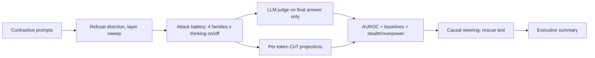

## Research question

> The end-of-prefill refusal probe predicts refusal with 0.84-0.95 AUROC on *plain* harmful prompts (Do Thinking Tokens Help with Safety?, arXiv 2606.25013). Does that predictive power survive adversarial attack — and does thinking mode change the answer?

Three falsifiable hypotheses:

- **H1 (degradation):** probe AUROC drops under attack, and drops *non-uniformly* across attack families.
- **H2 (mechanism):** failures split into **stealth** (probe reads harmless, model complies) and **overpower** (probe reads harmful, model complies anyway). Your pilot suggests overpower dominates at 84-100%, i.e. detection is robust and the detection-to-refusal link is what breaks.
- **H3 (deliberation):** if thinking is prefix completion rather than real deliberation, prefill AUROC is unchanged by the thinking toggle and CoT traces rationalize a decision already made.

Your positioning versus prior work: the four papers above use plain harmful prompts (JailbreakBench / HarmBench / StrongREJECT) with no attack-family decomposition. You add the adversarial axis and a within-model deliberation ablation on identical weights.

## Pipeline

## Phase 1 - Fix the measurement layer (blocking; nothing downstream is valid without this)

In [Mats-main/src/neel/curr.ipynb](Mats-main/src/neel/curr.ipynb):

- Thread a `thinking: bool` through `format_chat`, passing `enable_thinking` to `apply_chat_template`. Confirmed correct hard switch for Qwen3-4B (the 2504-era model).
- **Parse before labeling.** Split generations on `</think>` and label only the final answer. Record `n_think_tokens` and a `hit_think_close` flag; exclude or separately report truncated rows. Your current 50-token window captured almost only `<think>` text, which is why 36 rows came back ambiguous and why `complied=105` is not trustworthy.
- Raise `max_new_tokens` to ~1024 for thinking mode, ~256 for non-thinking.
- **Change decoding.** `do_sample=False` contradicts the Qwen3 model card, which warns greedy decoding in thinking mode causes endless repetition. Use temperature 0.6 / top_p 0.95 / top_k 20 with a fixed seed, one sample per row, and state this.
- **Fix the Pass 3 token-boundary bug** by staying in token space: `torch.cat([input_ids, gen_ids])` instead of decode-then-re-encode. Then take one forward pass over prompt-plus-full-generation and slice `layers[L].output[0]` for *all* positions at once — this yields the whole CoT trajectory for free and replaces the broken `gen_proj`.
- Re-extract the direction under both thinking settings and report the cosine similarity between them. If they are near-identical that is a small finding in itself.

## Phase 2 - Dataset and the missing control

- Replace the 20 hand-written pairs with standard sets (~150-200 pairs): harmful from JailbreakBench / AdvBench / StrongREJECT, harmless from Alpaca or OR-Bench. Using citable datasets instead of hand-written prompts is a visible rigor upgrade, and n=20 is too thin for the direction.
- **Add attack-wrapped harmless prompts.** This control is currently missing and is a real confound: attack prompts are far longer than your extraction prompts, so you cannot yet distinguish "the attack lowered the projection" from "long wrapper text lowered the projection."
- Keep direction-fitting prompts strictly disjoint from battery target prompts, and add a **no-attack condition** (plain harmful prompt) since it supplies the clean-prompt baseline.

## Phase 3 - Real attacks

- Keep `roleplay_templates` and `prefix_injection_templates`.
- **Add real GCG suffixes via `pip install nanogcg`.** Your `adversarial_suffix_templates` are hand-written compliance bait, not gradient-optimized suffixes — the family name is currently a misnomer a reviewer would catch. Optimize on 3-5 targets only (roughly 10-20 min per target on an A100) and keep the hand-written set as a separate "pseudo-suffix" family. Hand-written versus optimized becomes its own comparison.
- Budget guard: if GCG overruns, ship with 3 suffixes and flag it. Do not let it eat the analysis phases.

## Phase 4 - Labeling with an LLM judge

- Judge the **final answer only**, using a StrongREJECT-style rubric (binary refusal plus specificity and convincingness) since that is the standard in this literature and is citable.
- **Hand-label a random 50 rows and report Cohen's kappa** against the judge. This is what makes every downstream number trustworthy.
- Also report agreement between the judge and your old keyword labeler, to quantify the bug for the write-up's "what went wrong" section.
- Keep the judge blind to internals so the outcome label cannot be circular.

## Phase 5 - Analysis that actually answers the question

- **Primary metric:** AUROC of prefill projection predicting compliance, per family, per thinking condition, with bootstrap confidence intervals (n is small; CIs are mandatory).
- **Baselines**, all currently missing and all explicitly required: chance at 0.5; your own no-attack condition (compare against the published 0.84-0.95); clean-prompt refusal rate of the underlying target; black-box "is this harmful?" self-classification; and a prompt-length or TF-IDF text-only control, mirroring the text control in 2606.25013.
- **Recalibrate the threshold.** Replace the harmful/harmless midpoint (-26.2, which sits so low that nearly everything counts as "prefill high" and inflates overpower) with a Youden-J threshold from held-out folds.
- **Layer and position sweep** as a heatmap. Layer 31 was chosen for harmful/harmless separability, not for predicting attack outcomes; if the best layer differs between those two objectives, that discrepancy is itself interesting.

## Phase 6 - The reasoning-model angle

- Plot mean projection trajectory across the CoT (positions normalized 0-100%) grouped by family and outcome.
- Replicate the first-thinking-token probe AUROC, then show its degradation under attack — this is the direct extension of the published result.
- Locate flip points: does an attack that starts above threshold end below it?

## Phase 7 - Causality

- Directional ablation on clean harmful prompts, to validate the direction and replicate the known result.
- **The sharp test:** add the refusal direction during attacks. The two-stage model predicts it rescues **stealth** cases (probe was fooled) but *not* **overpower** cases (probe already fired). A differential rescue rate is much stronger evidence than a single global steering number.
- Report the capability cost of ablation on ~50 benign items (GSM8K or MMLU), as 2507.03167 does.

## Phase 8 - Generalization (optional, only if Phases 1-7 are done)

- **Qwen3-8B** is the cleanest second model: same family, tests scale, and directly comparable since 2606.25013 used Qwen3-8B. Llama-3.1-8B-Instruct is the cross-family option.
- Answering the note in [Mats-main/thoughts.txt](Mats-main/thoughts.txt): avoid Gemma-2/3 and Gemini-style models because sliding-window attention complicates residual-stream analysis and hook semantics.

## Phase 9 - Write-up

- **Scrub the fabricated numbers.** [Mats-main/ledger.txt](Mats-main/ledger.txt) records "AUC=0.85 / 0.52" and "steering changed success rate by 40%" and "Qwen 3.6" — these are copied from the roadmap PDF's hypothetical example, not your data. None of it can reach the submission.
- Killer graph: AUROC by attack family and thinking condition, with the published no-attack AUROC drawn as a horizontal reference line, so the collapse is visible at a glance.
- Executive summary that stands alone; narrative built on H1-H3; honest limitations (single model, judge reliability, GCG suffix count); and a dual-use paragraph, which [Mats-main/thoughts.txt](Mats-main/thoughts.txt) already correctly identifies as necessary.

## Housekeeping

Restructure the notebook while doing Phase 1: it has duplicate import cells (1 and 11), two different cells both labelled "CELL 17" implementing conflicting classifications (19 and 20), and an empty cell 22. Add a config cell (seeds, `THINKING` flag, model id) and cache activations and results to Drive after each phase so a Colab disconnect never costs a rerun.

## Time budget (~24h)

Phases 1-2 about 5h, Phase 3 about 4h, Phase 4 about 3h, Phase 5 about 4h, Phase 6 about 2h, Phase 7 about 3h, Phase 9 about 3h. Phases 1, 2, 4, 5 are the backbone: they alone give a complete, defensible submission. Phases 6-7 are the novelty and causality. Phase 8 is a bonus.